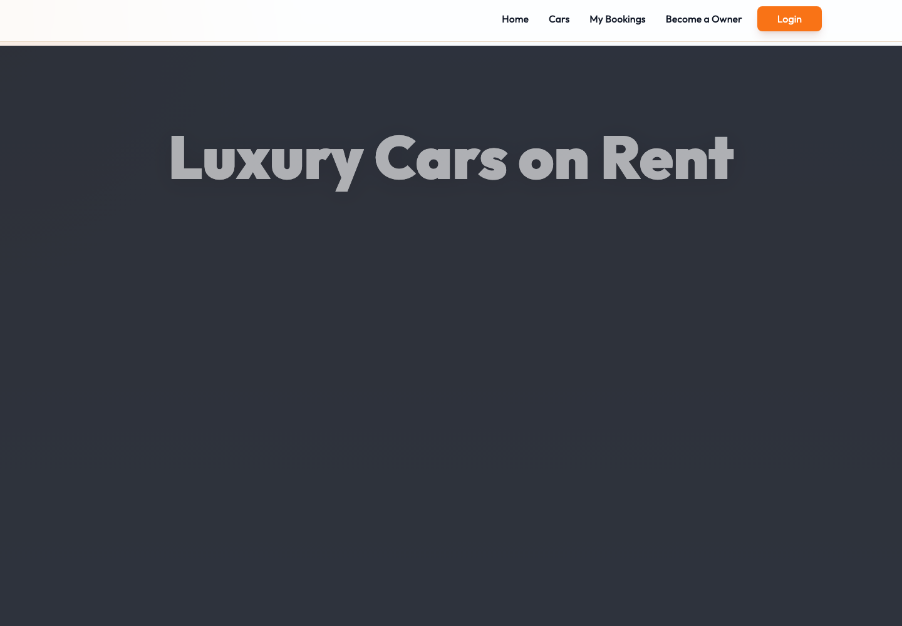

# Luxury Car Renting Site

Full-stack car rental platform with customer booking flows, authentication, owner dashboard tools, image uploads, and MongoDB-backed inventory management.

## Live Demo

[Open Luxury Car Renting Site](https://car-rental-app-three.vercel.app)

## Preview



## Project Highlights

- Built a React/Vite frontend for browsing cars, filtering inventory, viewing car details, and managing bookings.
- Implemented a Node.js/Express API with MongoDB models for users, cars, and bookings.
- Added JWT authentication with customer and owner flows.
- Created owner dashboard pages for adding cars, managing listings, and reviewing booking requests.
- Integrated ImageKit and Multer for uploaded car images.
- Added demo-data seeding and local fallback behavior to make the project easier to run and review.

## Tech Stack

| Area | Technology |
| --- | --- |
| Frontend | React, Vite, Tailwind CSS, React Router, Axios, Motion |
| Backend | Node.js, Express |
| Database | MongoDB, Mongoose |
| Auth | JWT, bcrypt |
| Media | ImageKit, Multer |
| Deployment | Vercel frontend and Vercel serverless backend |

## Folder Structure

```text
client/
  src/
    assets/        Static images, icons, and demo data
    components/    Shared UI components
    context/       App-wide state, API client, auth helpers
    pages/         Public and owner dashboard pages
server/
  configs/         Database, ImageKit, and seed setup
  controllers/     Route handler logic
  middleware/      Auth and upload middleware
  models/          Mongoose schemas
  routes/          Express route definitions
```

## Main Features

- Browse available rental cars
- Search cars by brand, model, category, or transmission
- View car details and booking form
- Register, login, and load user profile data
- Manage personal bookings
- Owner dashboard for adding cars, managing listings, and reviewing bookings
- Image upload support for car listings
- Demo starter inventory for the Cars page

## Local Setup

Clone the repository and install dependencies for both apps:

```bash
cd client
npm install

cd ../server
npm install
```

Create local environment files from the examples:

```bash
cp client/.env.example client/.env
cp server/.env.example server/.env
```

Set the required environment variables:

```text
client/.env
VITE_CURRENCY=Rs.
VITE_BASE_URL=

server/.env
PORT=3000
MONGODB_URI=mongodb+srv://<user>:<password>@<cluster>.mongodb.net/?appName=Cluster0
MONGODB_DB_NAME=car-rental
JWT_SECRET=your_jwt_secret_here
IMAGEKIT_PUBLIC_KEY=your_imagekit_public_key
IMAGEKIT_PRIVATE_KEY=your_imagekit_private_key
IMAGEKIT_URL_ENDPOINT=your_imagekit_url_endpoint
```

Run the backend:

```bash
cd server
npm run server
```

Run the frontend in another terminal:

```bash
cd client
npm run dev
```

The frontend runs on `http://localhost:5173` and proxies `/api` requests to `http://localhost:3000`.

## Available Scripts

Frontend:

```bash
npm run dev
npm run build
npm run lint
npm run preview
```

Backend:

```bash
npm run server
npm start
npm run reset:data
npm run reset:empty
npm run reset:demo
```

## Quality Checks

This repository includes a GitHub Actions CI workflow that installs dependencies, lints the frontend, builds the frontend, and verifies backend dependency installation on every push and pull request to `main`.

## Interview Notes

- `client/src/context/AppContext.jsx` centralizes auth state, car data, Axios config, and shared app actions.
- `client/src/pages/Cars.jsx` displays and filters the car inventory.
- `client/src/components/CarCard.jsx` controls each car card shown in the Cars grid.
- `client/src/pages/owner/AddCar.jsx`, `ManageCars.jsx`, and `ManageBookings.jsx` implement the owner workflow.
- `server/server.js` mounts the API routes and handles database connection setup.
- `server/models/Car.js`, `server/models/User.js`, and `server/models/Booking.js` define the core database structure.
- `server/configs/seed.js` creates demo users and starter cars for empty databases.
