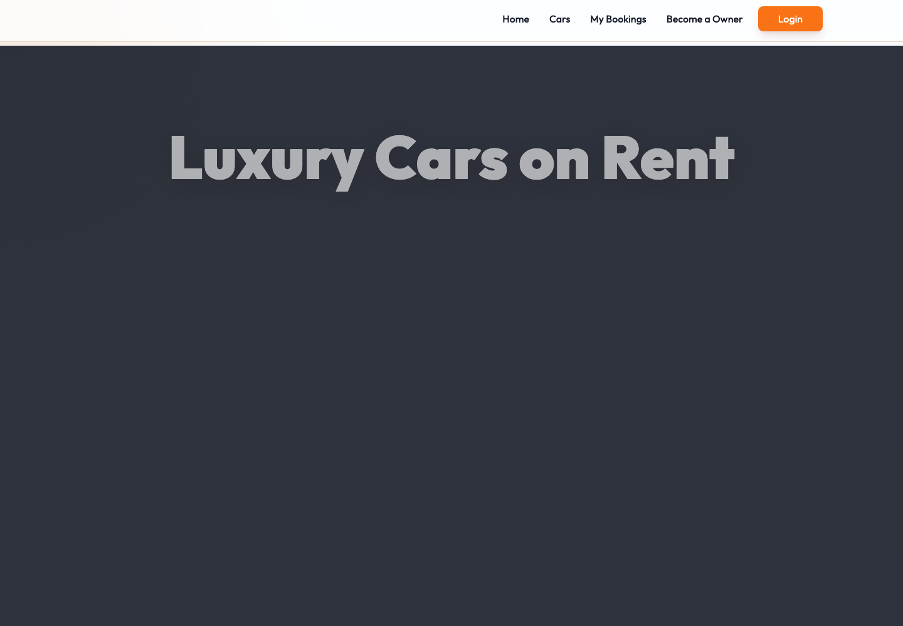

# Luxury Car Renting Site

Full-stack car rental platform with customer booking flows, authentication, owner dashboard tools, image uploads, and MongoDB-backed inventory management.

## Live Demo

[Open Luxury Car Renting Site](https://car-rental-app-three.vercel.app)

## Preview

## Project Highlights

- Built a React and Tailwind CSS interface for browsing cars and filtering available vehicles.
- Implemented JWT authentication and protected routes for the booking workflow.
- Developed customer booking management and an owner dashboard for vehicle inventory and reservations.
- Built Node.js and Express REST APIs with MongoDB models for users, cars, and bookings, and integrated ImageKit for car images.

## Tech Stack

React, Tailwind CSS, Node.js, Express.js, MongoDB, ImageKit
